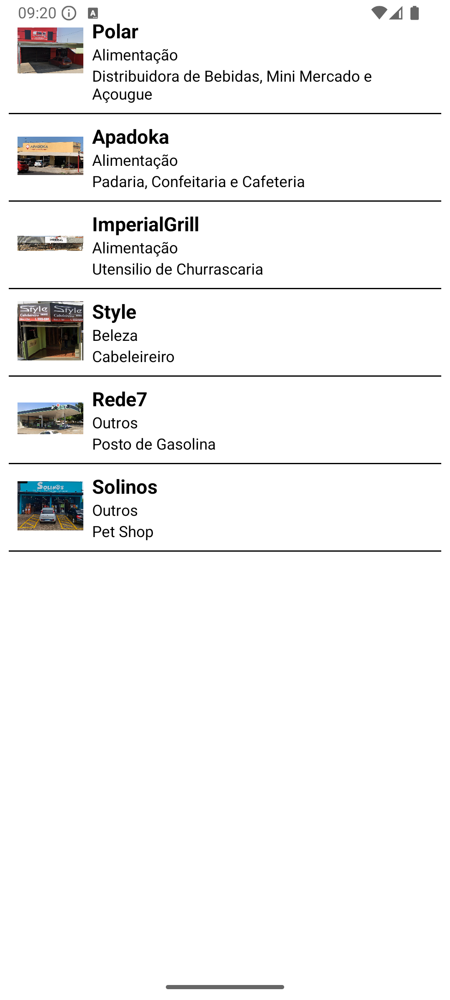
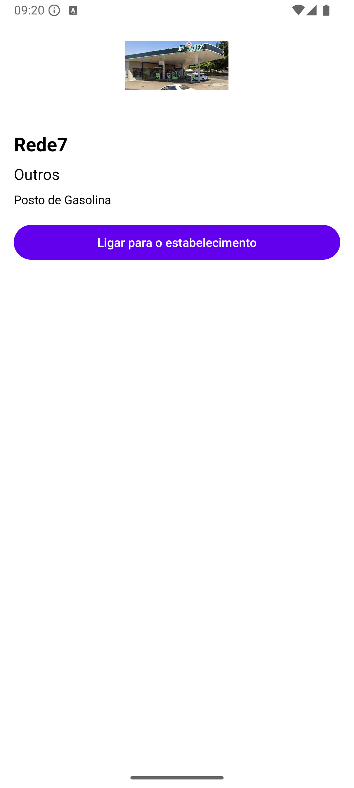
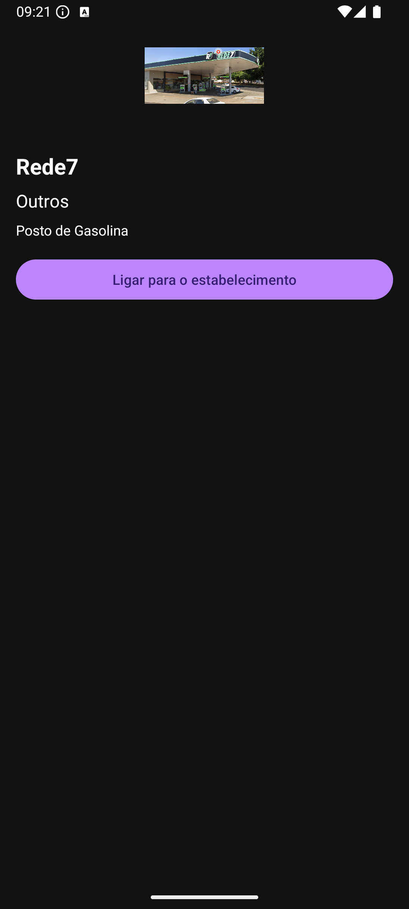
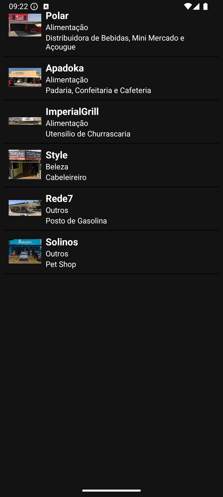
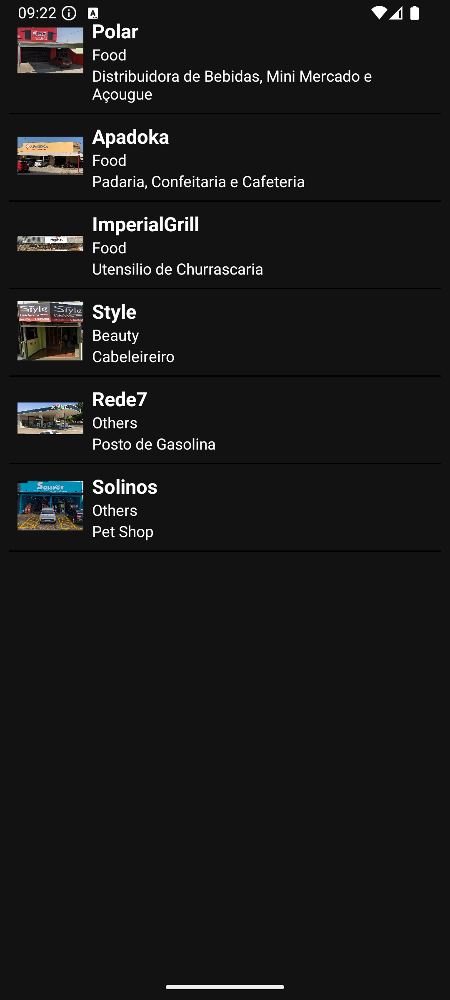

# Projeto Prático Avaliativo 1

**Disciplina:** Dispositivos Móveis 1  
**Aluno:** Bruno Ferreira

> Projeto Android desenvolvido como parte do curso de Desenvolvimento Mobile no IFSP

---

## Descrição

Aplicativo Android desenvolvido em **Kotlin** com o objetivo de exibir uma **lista de serviços locais** de um determinado bairro.  
O app mostra informações como nome, categoria, descrição e imagem de cada serviço.  
Ao tocar em um serviço, o usuário acessa uma tela de **detalhes**, com a opção de **ligar diretamente para o estabelecimento** por meio de uma Intent implícita.

---

## Funcionalidades

- Lista de serviços locais com imagem e descrição
- Tela de detalhes com botão para ligação (Intent implícita)
- Suporte a tema claro e escuro (Day/Night)
- Internacionalização (PT/EN)
- Navegação entre telas com Intents explícitas

---

## Demonstração

[Vídeo demonstração](imagens/video.webm)

---

## Capturas de tela

### Tema Claro

### Tema Escuro

### Aplicativo em Português

### Aplicativo em Inglês

---

## Tecnologias Utilizadas

- Kotlin  
- Android Studio  
- View Binding  
- ListView e Adapter  
- Intents explícitas e implícitas  
- Internacionalização
- Tema Day/Night

---

## Status do Projeto

Concluído — protótipo funcional com lista de serviços, tela de detalhes,  
tema dinâmico, suporte a idiomas e intents funcionando corretamente.

---

## Tecnologias utilizadasc

Linguagem de programação Kotlin aplicada no software Android Studio

---

## Aprendizados e Desafios

- Uso de View Binding para acesso direto aos componentes da interface  
- Implementação de Intents explícitas e implícitas  
- Configuração de temas (claro e escuro)  
- Adaptação da interface com internacionalização (PT/EN)  
- Integração do projeto com o GitHub e documentação via README

---

## Instalação

git clone https://github.com/Brunoo00/Projeto-1---DISPOSITIVOS-M-VEIS-1.git
